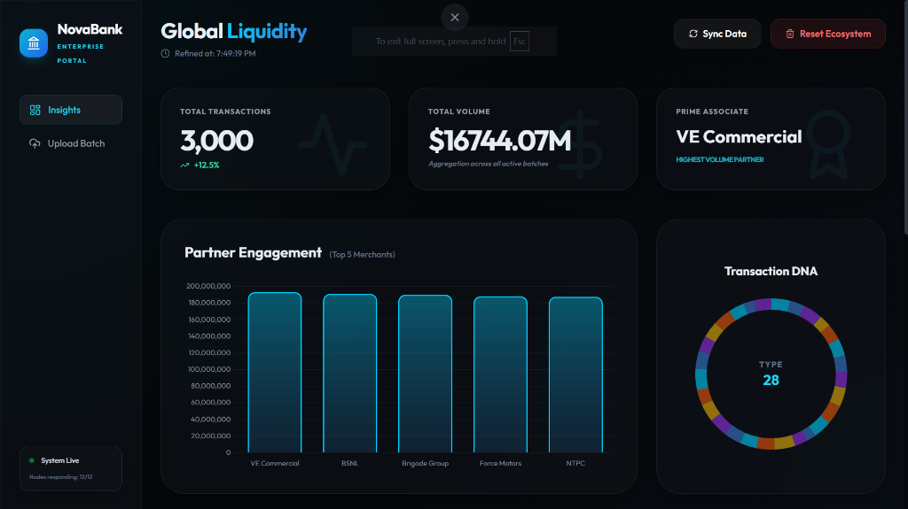
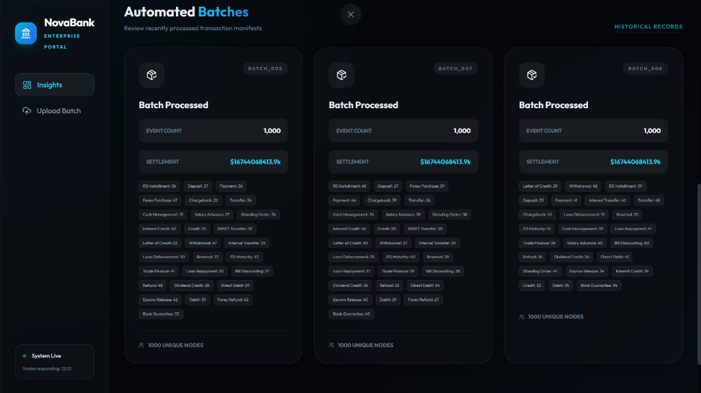
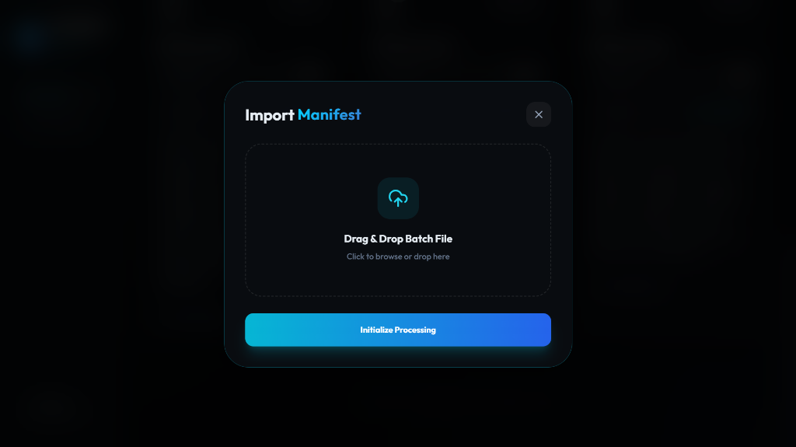

# NovaBank - Retail Banking Analytics Dashboard 🏦

**NovaBank** is a high-performance, real-time banking transaction analytics platform. It allows financial analysts to ingest large-scale transaction manifests (JSON) and visualize critical metrics, customer segments, and merchant activity through a sleek, modern dashboard.

## 👀 Screenshots

### 📊 Real-Time Analytics Dashboard


### 📂 Automated Batch Processing


### ☁️ Smart Manifest Ingestion


---

## ✨ Key Features

- 📜 **Multi-Format Ingestion**: Supports both legacy and expanded transaction JSON structures.
- ⚡ **High-Speed Processing**: Backend optimized with SQLAlchemy 2.0 and `asyncpg` for asynchronous database operations.
- 🧱 **Bulk Ingestion**: Robust batching logic (500 records/batch) to handle massive datasets without database parameter limits.
- 📊 **Real-Time Analytics**: Instant calculation of total volume, top merchants, customer growth, and risk scores.
- 🔄 **Ecosystem Reset**: One-click database wipe to start fresh for new testing cycles.
- 🎨 **Premium UI**: Glassmorphism design with Tailwind CSS, Lucide icons, and interactive charts.

---

## 🛠️ Technology Stack

- **Frontend**: HTML5, Vanilla CSS, Tailwind CSS (via CDN), Lucide Icons, Chart.js.
- **Backend**: FastAPI (Python), Pydantic V2 (Validation).
- **Database**: PostgreSQL (Relational) with SQLAlchemy 2.0 (ORM).
- **Environment**: Dotenv for secure configuration.

---

## 🚀 Getting Started

### 1. Prerequisites
- **Python 3.10+**
- **PostgreSQL 15+** installed and running.

### 2. Installation
Clone the repository and set up a virtual environment:
```powershell
git clone <your-repo-url>
cd retail_banking_transactions
python -m venv venv
.\venv\Scripts\activate
pip install -r requirements.txt
```

### 3. Database & Environment Setup
1. Create a `.env` file in the root directory (refer to `.env.example` if provided):
```ini
DB_USER=postgres
DB_PASSWORD=your_password
DB_HOST=127.0.0.1
DB_PORT=5432
DB_NAME=retail_banking_scratch_v1
```
2. Run the database creation script:
```powershell
python create_db.py
```

### 4. Running the Application
Start the FastAPI server:
```powershell
python main.py
```
Then, open `index.html` directly in your browser or serve it via a local live server.

---

## ✅ Validation & Rigorous Testing

The system includes a dedicated **Validation Suite** (`tests/validation_suite.py`) to ensure enterprise-grade stability.

- **📊 Database Integrity**: Automated checks for referential integrity (PK/FK), orphan records, and critical column constraints.
- **🛡️ API Robustness**: Verified atomic transactions with rollback on malformed input and sophisticated **Duplicate Prevention** (Upsert logic).
- **🚀 Performance Benchmarking**: Optimized batch processing capable of handling **700+ records per second**.

To run the full validation suite:
```powershell
.\venv\Scripts\python tests\validation_suite.py
```

---

## 📝 API Endpoints

- `POST /upload`: Bulk ingest transaction JSON files.
- `GET /summary/overall`: Fetch mission-critical global metrics.
- `GET /files`: List all ingested batch manifests.
- `POST /clear`: Wipe the ecosystem for a fresh start.

---

## 🤝 Contributing
Contributions are welcome! Please open an issue or submit a pull request for any improvements.

---

## ⚖️ License
This project is licensed under the MIT License.

---
*Developed with ❤️ by Rishiraj Thakur*
